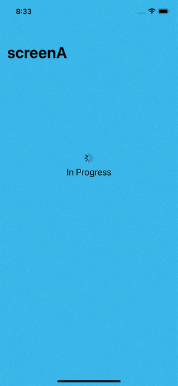

# DESkooveChallenge
Navigation flow challenge

<p align="center">
  
  
  
</p>

P.S. The server code provided for the challenge returns false for every request, every time. At least this was the case for me and I had to change the code a little to get it to return successful responses.

The part I changed is in this function:

```javascript
function processRequest(
  type,
  result,
  delayOverride,
  successOverride,
  successBlock
) {
  const delaySeconds =
    typeof delayOverride === 'string'
      ? parseInt(delayOverride)
      : getRandomInt(16)
  const success =
    typeof successOverride === 'string'
      ? successOverride === 'true'
        ? true
        : false
      : getRandomInt(2) // Changed this bit, it was 1
  console.log(
    `==> Handling '${type}' with delay of '${delaySeconds}' seconds and success '${
      success ? 'true' : 'false'
    }'`
  )
  setTimeout(() => {
    if (success) {
      successBlock()
    } else {
      result.status(500).send('Something went wrong')
    }
  }, delaySeconds * 1000)
}
```
